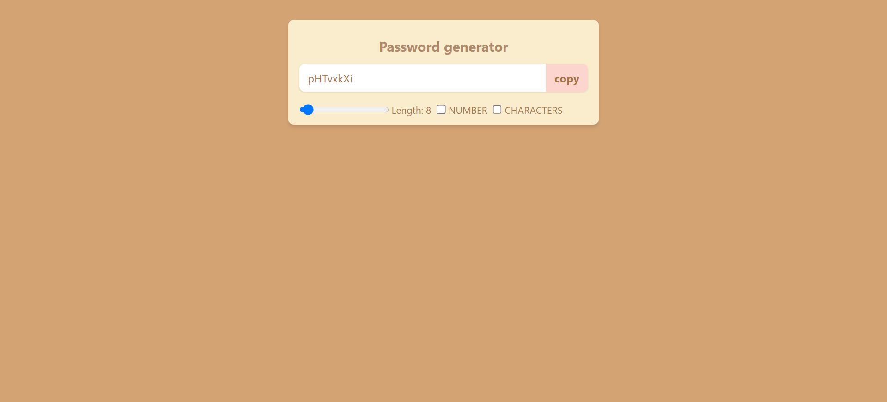

# Password Generator App



## Description

The Password Generator App is a React-based web application that allows users to generate strong and secure passwords with various customizable options. Users can specify the password length and choose to include numbers and special characters in the generated password.

## Features

- Generate random and secure passwords.
- Customize password length.
- Include or exclude numbers and special characters.
- Copy generated passwords to the clipboard.

## Technologies Used

- React
- JavaScript
- CSS
- Clipboard API

## Installation

1. Clone the repository:

   ```bash
   git clone https://github.com/kratin01/Password-generator.git
